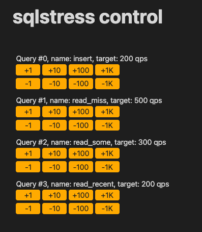

# SQL Stress

Simple tool to stress a database. Supports MySQL and PostgreSQL

## How it works

Given a set of queries and a target throughput, the application will try to reach the throughput target by manipulating the amount of workers & connections to the db

Features:
* Supports initialization commands, so you can create and populate tables
* Dynamic query values, as values can be filled on the spot randomly
* Query throughput targets can be modified in realtime through a web page that runs in a embedded http server
* Allows keeping a set of idle connections to simulate idle connection load on the db side

## Example

The [example](example/) dir contains a Makefile that can launch a local postgres docker image and run a stress command

To run postgres:
```
cd example
make postgres
```

In another shell, run sql stress:
```
cd example
make stress

INFO  2025/10/26 12:10:35 ------
INFO  2025/10/26 12:10:35 Running 6 setup commands
INFO  2025/10/26 12:10:35 Control server listening on localhost:8090
INFO  2025/10/26 12:10:50 Setup done
INFO  2025/10/26 12:10:50 Opening 10 idle connections
INFO  2025/10/26 12:10:50 Idle connections done
INFO  2025/10/26 12:10:50 ------
INFO  2025/10/26 12:10:50 Query #0 insert    : 0.0/s (200.0/s), avg rate per connection: 0.0/s, avg latency: NaNms, connections: 0 (+1) ~
INFO  2025/10/26 12:10:50 Query #1 read_miss : 0.0/s (500.0/s), avg rate per connection: 0.0/s, avg latency: NaNms, connections: 0 (+1) ~
INFO  2025/10/26 12:10:50 Query #2 read_some : 0.0/s (300.0/s), avg rate per connection: 0.0/s, avg latency: NaNms, connections: 0 (+1) ~
INFO  2025/10/26 12:10:50 Query #3 read_recen: 0.0/s (200.0/s), avg rate per connection: 0.0/s, avg latency: NaNms, connections: 0 (+1) ~
INFO  2025/10/26 12:10:50 ------
INFO  2025/10/26 12:10:51 Query #0 insert    : 7.8/s (200.0/s), avg rate per connection: 7.8/s, avg latency: 5.0ms, connections: 1 (+9) ~
INFO  2025/10/26 12:10:51 Query #1 read_miss : 8.0/s (500.0/s), avg rate per connection: 8.0/s, avg latency: 4.3ms, connections: 1 (+19) ~
INFO  2025/10/26 12:10:51 Query #2 read_some : 8.0/s (300.0/s), avg rate per connection: 8.0/s, avg latency: 4.2ms, connections: 1 (+9) ~
INFO  2025/10/26 12:10:51 Query #3 read_recen: 8.0/s (200.0/s), avg rate per connection: 8.0/s, avg latency: 4.3ms, connections: 1 (+9) ~
INFO  2025/10/26 12:10:51 ------
INFO  2025/10/26 12:10:52 Query #0 insert    : 14.0/s (200.0/s), avg rate per connection: 14.0/s, avg latency: 5.6ms, connections: 1 (+5) ~
INFO  2025/10/26 12:10:52 Query #1 read_miss : 14.0/s (500.0/s), avg rate per connection: 14.0/s, avg latency: 5.2ms, connections: 1 (+14) ~
INFO  2025/10/26 12:10:52 Query #2 read_some : 14.0/s (300.0/s), avg rate per connection: 14.0/s, avg latency: 5.3ms, connections: 1 (+8) ~
INFO  2025/10/26 12:10:52 Query #3 read_recen: 14.0/s (200.0/s), avg rate per connection: 14.0/s, avg latency: 5.3ms, connections: 1 (+5) ~
INFO  2025/10/26 12:10:52 ------
INFO  2025/10/26 12:10:53 Query #0 insert    : 59.4/s (200.0/s), avg rate per connection: 9.9/s, avg latency: 3.3ms, connections: 6 (+4) ~
INFO  2025/10/26 12:10:53 Query #1 read_miss : 131.6/s (500.0/s), avg rate per connection: 8.8/s, avg latency: 2.7ms, connections: 15 (+5) ~
INFO  2025/10/26 12:10:53 Query #2 read_some : 83.6/s (300.0/s), avg rate per connection: 9.3/s, avg latency: 2.5ms, connections: 9 (+1) ~
INFO  2025/10/26 12:10:53 Query #3 read_recen: 59.6/s (200.0/s), avg rate per connection: 9.9/s, avg latency: 2.7ms, connections: 6 (+4) ~
...
INFO  2025/10/26 12:11:19 ------
INFO  2025/10/26 12:11:20 Query #0 insert    : 216.8/s (200.0/s), avg rate per connection: 43.4/s, avg latency: 3.0ms, connections: 5 (+0)
INFO  2025/10/26 12:11:20 Query #1 read_miss : 534.4/s (500.0/s), avg rate per connection: 44.5/s, avg latency: 2.8ms, connections: 12 (+0) ~
INFO  2025/10/26 12:11:20 Query #2 read_some : 307.0/s (300.0/s), avg rate per connection: 43.9/s, avg latency: 2.6ms, connections: 7 (+0)
INFO  2025/10/26 12:11:20 Query #3 read_recen: 218.9/s (200.0/s), avg rate per connection: 43.8/s, avg latency: 2.8ms, connections: 5 (+0)
INFO  2025/10/26 12:11:20 ------
^CWARN  2025/10/26 12:11:20 Received INTERRUPT signal, shutting down
```

While the tool is running, you can access [localhost:8090](http://localhost:8090) to control query targets:



You can check out both [example/config.yaml](example/config.yaml) and [sample-config.yaml](sample-config.yaml) for reference config files